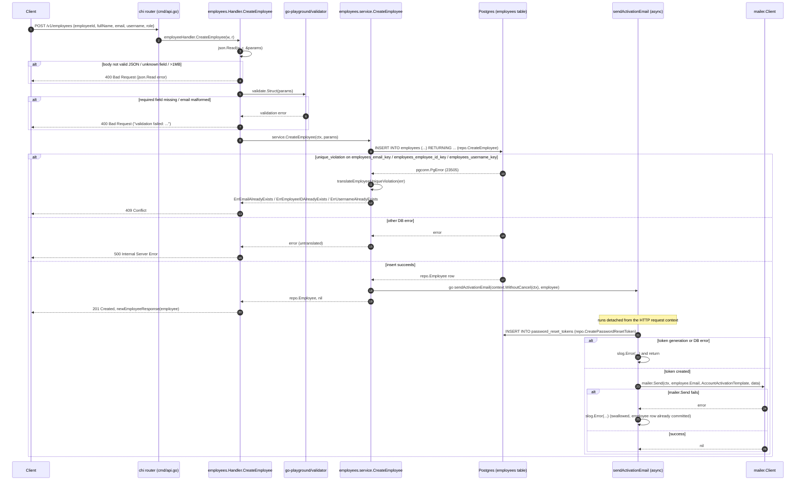
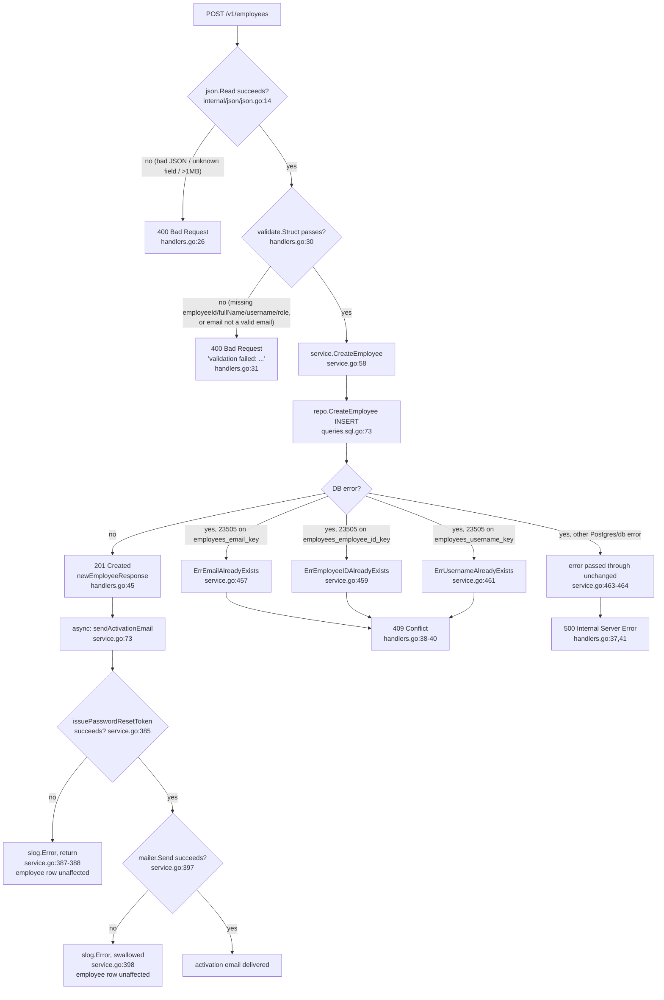
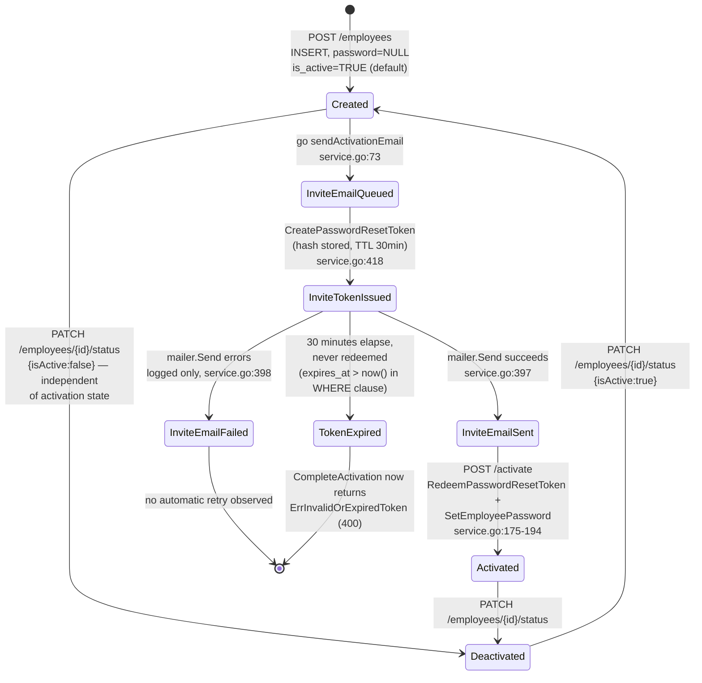

# Flow: Admin creates an employee

> New doc convention (`docs/flows/`), introduced for this explainer. `docs/adr/`
> is decision records and `.scratch/<slug>/` is spec/issue tracking for
> planned work — neither fits a walkthrough of an already-shipped feature, so
> this lives in a new sibling directory. Confirm this is the right home.

`POST /v1/employees` lets an admin caller create a new employee row (employee ID,
name, email, username, role). The account is created without a password;
creation fires a background email containing a time-limited activation link,
and the employee sets their own password by redeeming that link at the public
`POST /v1/activate` endpoint. Every claim below is cited to the exact file and
line read.

## 1. Sequence diagram — full request lifecycle



### Steps

1. **No auth/admin middleware guards this route.** `cmd/api.go:31-92` registers only global middleware — `cors.Handler`, `middleware.RequestID`, `middleware.ClientIPFromRemoteAddr`, `middleware.Logger`, `middleware.Recoverer`, `middleware.Timeout(60s)` (`cmd/api.go:34-51`) — before mounting `/v1`. `r.Post("/employees", employeeHandler.CreateEmployee)` at `cmd/api.go:66` has no `r.Use(...)` wrapping it, and I found no auth, JWT, session, or role-check middleware anywhere in the repo (grep for `Bearer`, `jwt`, `JWT`, `Authorization`, `RequireAuth`, `IsAdmin`, `RoleAdmin` across non-test, non-mock `.go` files only matched the CORS `AllowedHeaders` list at `cmd/api.go:37`, which merely permits the client to *send* an `Authorization` header — nothing reads or verifies it). **I cannot confirm this route is actually admin-gated from source; it currently is not.** This should be flagged to the user as surprising/possibly incomplete, not assumed away.
2. The chi router dispatches `POST /v1/employees` to `Handler.CreateEmployee` (`internal/employees/handlers.go:23`).
3. `json.Read(w, r, &params)` (`internal/employees/handlers.go:25`, implementation at `internal/json/json.go:14-22`) caps the body at 1MB (`http.MaxBytesReader`), decodes with `DisallowUnknownFields()`, and populates `createEmployeeParams`. Any decode error (malformed JSON, unknown field, oversized body) returns **400 Bad Request** with the raw error text (`internal/employees/handlers.go:26`).
4. `validate.Struct(params)` (`internal/employees/handlers.go:30`, validator instance at `internal/employees/handlers.go:13`) checks the struct tags on `createEmployeeParams` (`internal/employees/types.go:38-44`): `EmployeeID` `required`, `FullName` `required`, `Email` `required,email`, `Username` `required`, `Role` `required`. Any failure returns **400 Bad Request** with body `"validation failed: " + err.Error()` (`internal/employees/handlers.go:31`).
5. `h.service.CreateEmployee(r.Context(), params)` is called (`internal/employees/handlers.go:35`).
6. Inside the service (`internal/employees/service.go:58-76`), `s.repo.CreateEmployee` runs the INSERT (see SQL section below) with exactly the 5 client-supplied fields — no password, no store_id, no role validation against an allow-list beyond "non-empty string".
7. On a Postgres error, `translateEmployeeUniqueViolation` (`internal/employees/service.go:450-466`) checks `errors.As(err, &pgErr)` and `pgErr.Code == "23505"` (`internal/employees/service.go:25`); if so it maps `pgErr.ConstraintName` to one of three sentinel errors (`internal/employees/service.go:29-33`, values at `internal/employees/types.go:18-20`) — `employees_email_key` → `ErrEmailAlreadyExists`, `employees_employee_id_key` → `ErrEmployeeIDAlreadyExists`, `employees_username_key` → `ErrUsernameAlreadyExists`. Any other error (including a non-`23505` Postgres error, or a plain non-Postgres error) passes through unchanged.
8. Back in the handler, `errors.Is(err, ErrEmailAlreadyExists) || ... ErrUsernameAlreadyExists || ... ErrEmployeeIDAlreadyExists` maps to **409 Conflict**; everything else defaults to **500 Internal Server Error** (`internal/employees/handlers.go:36-43`).
9. On success, the service kicks off `go s.sendActivationEmail(context.WithoutCancel(ctx), employee)` (`internal/employees/service.go:73`) — explicitly detached from the request context ("the HTTP handler's request context is canceled the moment it returns", comment at `internal/employees/service.go:70-72`) — and returns immediately with the created `repo.Employee`, **not** waiting for the email.
10. The handler responds **201 Created** with `newEmployeeResponse(employee)` (`internal/employees/handlers.go:45`, shape at `internal/employees/types.go:131-155`), which deliberately omits the `Password` field present on `repo.Employee` (comment at `internal/employees/types.go:125-130`, confirmed by `TestEmployeeHandler_ResponseOmitsPasswordHash` in `internal/employees/handlers_test.go:1038-1080`).
11. In the background goroutine, `sendActivationEmail` (`internal/employees/service.go:384-400`) calls `issuePasswordResetToken(ctx, employee, "/activate")` (`internal/employees/service.go:412-428`), which generates a 32-byte random token (`generateActivationToken`, `internal/employees/service.go:432-438`), inserts its SHA-256 digest via `CreatePasswordResetToken` with a 30-minute TTL (`activationTokenTTL`, `internal/employees/service.go:37`), and builds a link `"{APP_URL}/activate?token={raw token}"` where `APP_URL` defaults to `http://localhost:3000` if unset (`internal/env/env.go:9-16`, used at `internal/employees/service.go:427`). The raw token is never persisted — only its hash is (comment at `internal/employees/service.go:402-411`).
12. `s.mailer.Send(ctx, employee.Email, mailer.AccountActivationTemplate, data)` (`internal/employees/service.go:397`) renders `internal/mailer/templates/account_activation.tmpl` (Vietnamese-language subject/body, `internal/mailer/templates/account_activation.tmpl:1-16`) and dispatches via whichever `mailer.Client` was chosen at startup (`mailer.New`, `internal/mailer/factory.go:27-42`: `MailpitClient` for `development`/`staging`/unset `APP_ENV`, `BrevoClient` for `production`, chosen when `app.mailer` is constructed — not shown in the files I read for this trace, but wired via `application.mailer` in `cmd/api.go:27`/`64`).
13. **Any failure in step 11 or 12 (token generation, DB error, or mailer error) is logged via `slog.Error` and swallowed** (`internal/employees/service.go:386-389`, `:397-399`) — it never surfaces back to the HTTP client, since the response was already sent in step 10. This is confirmed by tests `TC-POST-07`/`08`/`09` in `internal/employees/service_test.go:187-` which assert `CreateEmployee` still returns `nil` error and a populated employee even when the mailer call fails. **The employee row is not transactional with the email**: the INSERT is fully committed in step 6 regardless of what happens afterward — there is no rollback path if the email fails.

## 2. Flowchart — validation and decision logic



### Steps

1. `B`/`B1`: request-body decoding gate, `internal/json/json.go:14-22` called from `internal/employees/handlers.go:25-28`. Failure short-circuits before any validation or service call, per `TS-HDL-02`-style handler tests confirming validation failures never reach the mocked service (`internal/employees/handlers_test.go:940-955`).
2. `C`/`C1`: struct-tag validation, `internal/employees/handlers.go:30-33` against tags on `internal/employees/types.go:38-44`. All five fields (`employeeId`, `fullName`, `email`, `username`, `role`) are `required`; `email` additionally must satisfy validator's `email` rule. There is no length, charset, or role-enum constraint beyond "non-empty" visible in the struct tags — role is a free-form string at this layer.
3. `D`/`E`: on passing validation, the handler defers entirely to `service.CreateEmployee` → `repo.CreateEmployee`, which is a single INSERT (see SQL section) — no pre-check `SELECT` for duplicates exists; uniqueness is enforced purely by the database's unique constraints and detected after the fact via the Postgres error code.
4. `F`/`G`/`H1-H4`: the fork on `pgErr.Code == "23505"` and `pgErr.ConstraintName` happens in `translateEmployeeUniqueViolation` (`internal/employees/service.go:450-466`). Only the three named constraints get mapped to sentinel errors; anything else (a different constraint, a non-Postgres error, a connection failure) is returned as-is and becomes a 500, confirmed by `TC-POST-04` (`internal/employees/service_test.go:143-156`, a plain `errors.New("connection refused")` staying untranslated) and the handler's `TS-HDL-12` test (`internal/employees/handlers_test.go:991-1000`).
5. `G1`/`K`/`K1`/`L`/`L1`/`M`: the async email sub-flow, entirely non-blocking for the HTTP response already sent at `G`. Both failure branches (`K1`, `L1`) are logged only, never surfaced to any caller — there is no retry, no dead-letter, no status field on the employee row indicating "invite email failed to send" that I could find in `internal/adapters/postgresql/sqlc/models.go:14-26` (the `Employee` struct has no such column).

## 3. State diagram — employee activation status

The `employees` table has no explicit status/state column for activation — I inferred this diagram from two independently-observable facts: (a) `password BYTEA` is nullable with no default (`internal/adapters/postgresql/migrations/00001_create_employees.sql:10`), so a freshly created employee has `password = NULL`; and (b) `password_reset_tokens.used_at` becomes non-null only when `CompleteActivation` redeems a token (`RedeemPasswordResetToken`, `internal/adapters/postgresql/sqlc/queries.sql.go:651-676`). `is_active` is a separate, independent boolean (defaults `TRUE` per `internal/adapters/postgresql/migrations/00004_employees_active_by_default.sql:2`) toggled only via `PATCH /employees/{id}/status` (`SetEmployeeActive`) — it is not part of the activation-link flow and is not flipped by `CompleteActivation`. Treat this diagram as a reasonable inference from schema + code, not a state machine the code names explicitly.



### Steps

1. `Created`: the row committed by `repo.CreateEmployee` (`internal/employees/service.go:59-65`) — `password` is `NULL`, `is_active` is `TRUE` by column default (migration `00004`).
2. `InviteEmailQueued` → `InviteTokenIssued`: `sendActivationEmail` → `issuePasswordResetToken` inserts a `password_reset_tokens` row via `CreatePasswordResetToken` (`internal/employees/service.go:418-425`, SQL at `internal/adapters/postgresql/sqlc/queries.sql.go:98-108`) with `expires_at = now() + 30m`.
3. `InviteEmailSent` / `InviteEmailFailed`: fork on `s.mailer.Send` result (`internal/employees/service.go:397-399`) — both are terminal from the code's perspective; nothing re-queues a failed send. An admin's only documented recovery lever visible in this package is `BulkSendPasswordResetLinks` (`internal/employees/service.go:215-249`), which issues a **new** token via the same `issuePasswordResetToken` helper — but only for employees where `employee.IsActive` is true (`internal/employees/service.go:225-228`, `ErrEmployeeNotActive`).
4. `Activated`: reached via the public `POST /activate` endpoint (`internal/employees/handlers.go:221-243`) → `service.CompleteActivation` (`internal/employees/service.go:175-194`), which atomically redeems the token (`RedeemPasswordResetToken`'s `UPDATE ... WHERE token_hash=$1 AND used_at IS NULL AND expires_at > now()`, `internal/adapters/postgresql/sqlc/queries.sql.go:651-657`) and then sets the bcrypt-hashed password via `SetEmployeePassword`.
5. `TokenExpired`: implicit — once `expires_at <= now()`, `RedeemPasswordResetToken`'s `WHERE` clause no longer matches, so `pgx.ErrNoRows` is returned and translated to `ErrInvalidOrExpiredToken` → **400 Bad Request** (`internal/employees/service.go:177-180`, `internal/employees/handlers.go:233-238`). The same generic error is returned for an unknown or already-used token, by design (comment at `internal/employees/types.go:27-31`) — the endpoint deliberately never reveals which of the three reasons applied.
6. `Deactivated`: `is_active` is flipped independently by `PATCH /employees/{id}/status` → `SetEmployeeActive` (`internal/employees/handlers.go:134-162`, `internal/employees/service.go:128-140`) — this is orthogonal to whether the employee has ever completed activation; a never-activated employee can be deactivated, and an activated one can be reactivated, with no interaction with `password_reset_tokens`.

## SQL — exact query and constraints

From `internal/adapters/postgresql/sqlc/queries.sql.go:59-96`:

```sql
-- name: CreateEmployee :one
INSERT INTO employees (employee_id, full_name, email, username, role)
VALUES ($1, $2, $3, $4, $5)
RETURNING id, employee_id, full_name, email, username, password, role, is_active, created_at, updated_at, store_id
```

Table definition, `internal/adapters/postgresql/migrations/00001_create_employees.sql:4-16` (plus `00004` and `00007` for later columns):

```sql
CREATE TABLE employees (
    id BIGSERIAL PRIMARY KEY,
    employee_id VARCHAR(20) NOT NULL UNIQUE,
    full_name VARCHAR(255) NOT NULL,
    email CITEXT NOT NULL UNIQUE,
    username VARCHAR(50) NOT NULL UNIQUE,
    password BYTEA,
    role VARCHAR(50) NOT NULL,
    is_active BOOLEAN NOT NULL DEFAULT TRUE,   -- default flipped to TRUE in migration 00004
    must_change_password BOOLEAN NOT NULL DEFAULT TRUE,
    created_at TIMESTAMPTZ NOT NULL DEFAULT now(),
    updated_at TIMESTAMPTZ NOT NULL DEFAULT now()
);
```

- `employee_id`, `email` (case-insensitive via `CITEXT`), and `username` each have a standalone `UNIQUE` constraint — Postgres names them `employees_employee_id_key`, `employees_email_key`, `employees_username_key` respectively (default naming, confirmed by the constants at `internal/employees/service.go:29-33`). No `CHECK` constraint on `role` was found in the migrations I read — it accepts any non-empty string at the HTTP layer and any `VARCHAR(50)` at the DB layer.
- `password` and `store_id` (added in migration `00007_add_employees_store_id.sql`, which also defines the FK's `ON DELETE SET NULL`) are both left unset (`NULL`) by `CreateEmployee` — a newly created employee has no store assignment and no password until activation.
- `must_change_password` exists on the table (default `TRUE`) but is **not** in the `CreateEmployee` `RETURNING` list, not in `repo.Employee` (`internal/adapters/postgresql/sqlc/models.go:14-26` has no such field), and I found no code path in `internal/employees/*.go` that reads or writes it. I cannot confirm from source that this column is used anywhere in the create-employee flow — flagging as ambiguous/dead rather than guessing at its purpose.

## Notable gaps and open questions (not guessed — explicitly unconfirmed)

- **No admin/auth gate found on `POST /v1/employees`** (or any `/v1/employees*` route): see step 1 of the sequence walkthrough above. If an auth layer exists (e.g., enforced by an API gateway or reverse proxy outside this repo), it is not visible in this codebase.
- **No ADR covers employee creation, invites, roles, or auth.** `docs/adr/0001`–`0006` are all about `Store`/Wifi Whitelist; none reference `employees`, `password_reset_tokens`, or activation.
- **`must_change_password` column appears unused** by the create-employee (or any employees-package) code path I read.
- **Mailer transport selection** (`mailer.New`, `internal/mailer/factory.go:27-42`, picks `MailpitClient` vs `BrevoClient` by `APP_ENV`) is wired into `application.mailer` before `cmd/api.go`'s `mount()` runs, but the construction call itself (presumably in `cmd/main.go`) was not part of this trace's required reading list — noting it's referenced, not fully re-derived here.
