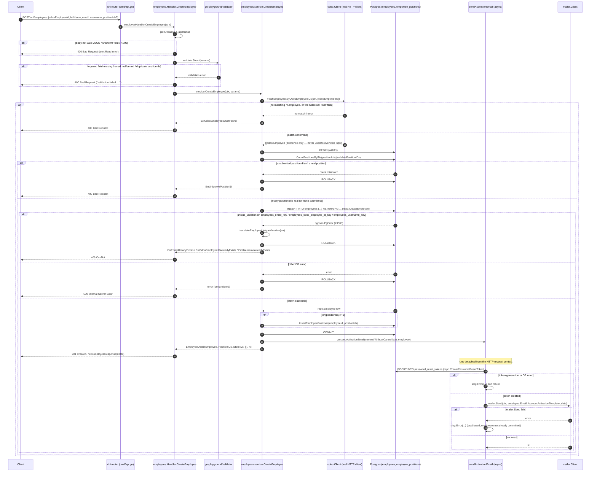
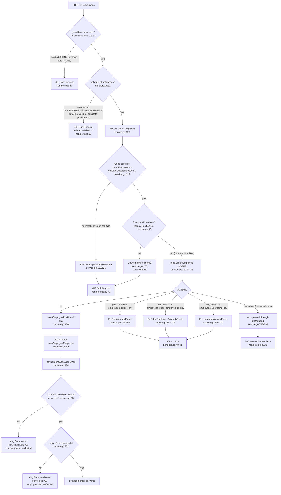
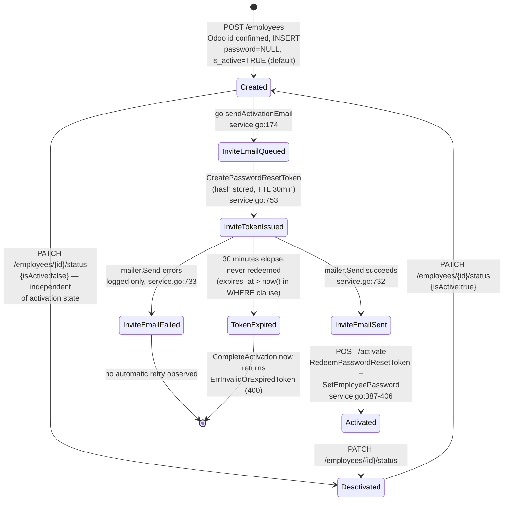

# Flow: Admin creates an employee

> New doc convention (`docs/flows/`), introduced for this explainer. `docs/adr/`
> is decision records and `.scratch/<slug>/` is spec/issue tracking for
> planned work — neither fits a walkthrough of an already-shipped feature, so
> this lives in a new sibling directory. Confirm this is the right home.

`POST /v1/employees` lets an admin caller create a new employee row from
`odoo_employee_id`, `full_name`, `email`, `username`, and an optional set of
`position_ids` — there is no `role` field (replaced by the many-to-many
`Position` concept, ADR-0008) and no store assignment at creation (store
membership is Odoo-owned and populated exclusively by `SyncEmployees`,
ADR-0009). Before anything is written, the submitted `odoo_employee_id` is
checked against Odoo's real `hr.employee` data — a non-existent id, or Odoo
being unreachable at all, rejects the write (ADR-0007, fail-closed). The
account is created without a password; creation fires a background email
containing a time-limited activation link, and the employee sets their own
password by redeeming that link at the public `POST /v1/activate` endpoint.
Every claim below is cited to the exact file and line read.

## 1. Sequence diagram — full request lifecycle



### Steps

1. **No auth/admin middleware guards this route**, and this is deliberate, not
   an oversight: the spec this feature shipped from explicitly scopes it out
   ("No authentication/authorization gating is added to any endpoint —
   employees, positions, or otherwise — this matches the existing,
   repo-wide state today and is not part of this change",
   `.scratch/employee-odoo-integration/spec.md:104`). `cmd/api.go`'s
   `mount()` registers only global middleware — `cors.Handler`,
   `middleware.RequestID`, `middleware.ClientIPFromRemoteAddr`,
   `middleware.Logger`, `middleware.Recoverer`,
   `middleware.Timeout(60s)` (`cmd/api.go:36-53`) — before mounting `/v1`.
   `r.Post("/employees", employeeHandler.CreateEmployee)` at
   `cmd/api.go:64` has no `r.Use(...)` wrapping it, and there is still no
   auth, JWT, session, or role-check middleware anywhere in the repo (the
   only `Authorization`-related hit is the CORS `AllowedHeaders` list at
   `cmd/api.go:39`, which merely permits the client to *send* the header —
   nothing reads or verifies it).
2. The chi router dispatches `POST /v1/employees` to `Handler.CreateEmployee`
   (`internal/employees/handlers.go:24`).
3. `json.Read(w, r, &params)` (`internal/employees/handlers.go:26`,
   implementation at `internal/json/json.go:14-22`) caps the body at 1MB
   (`http.MaxBytesReader`), decodes with `DisallowUnknownFields()`, and
   populates `createEmployeeParams`. Any decode error (malformed JSON,
   unknown field, oversized body) returns **400 Bad Request** with the raw
   error text (`internal/employees/handlers.go:27`).
4. `validate.Struct(params)` (`internal/employees/handlers.go:31`, validator
   instance at `internal/employees/handlers.go:14`) checks the struct tags on
   `createEmployeeParams` (`internal/employees/types.go:53-59`):
   `OdooEmployeeID`/`FullName`/`Email`/`Username` are all `required`
   (`Email` additionally `email`-formatted); `PositionIDs` is optional
   (`omitempty`) but, when present, its entries must be unique and non-zero
   (`unique,dive,required`). There is no `role` field at all — it was
   dropped from the schema (migration `00009_employee_odoo_id_refactor.sql:2,12`)
   and replaced by the many-to-many `Position` concept. Any validation
   failure returns **400 Bad Request** with body
   `"validation failed: " + err.Error()` (`internal/employees/handlers.go:32`).
5. `h.service.CreateEmployee(r.Context(), params)` is called
   (`internal/employees/handlers.go:36`).
6. Before any write, the service confirms the submitted `odoo_employee_id`
   against real Odoo data: `validateOdooEmployeeID`
   (`internal/employees/service.go:110-126`) calls
   `s.odoo.FetchEmployeesByOdooEmployeeIDs(ctx, []int64{odooEmployeeID})`
   and checks the returned set for an exact id match. **Existence-only** —
   a match lets the write proceed with the admin-submitted `fullName`/
   `email` exactly as given; Odoo's own name/email for that id are never
   read here. Both "Odoo has no such id" and "the Odoo call itself failed"
   (timeout, 5xx, network error) map to the same sentinel,
   `ErrOdooEmployeeIDNotFound` (`internal/employees/service.go:118,125`) —
   this fails closed, per ADR-0007: an unverified id must never enter the
   system, and an unreachable Odoo can't be distinguished from "not found"
   without trusting an unverifiable claim. The handler maps this sentinel to
   **400 Bad Request** (`internal/employees/handlers.go:42-43`).
7. Once the Odoo id is confirmed, the rest of the write runs inside one
   transaction (`s.withTx`, `internal/employees/service.go:134`,
   constructed at `internal/employees/service.go:71-89`). First,
   `validatePositionIDs` (`internal/employees/service.go:91-108`) — if
   `PositionIDs` is non-empty, it round-trips `CountPositionsByIDs` and
   compares the count against the number of distinct submitted ids; any
   mismatch (an id that isn't a real position) returns
   `ErrUnknownPositionID` and the transaction rolls back
   (`internal/employees/service.go:104-106`), which the handler maps to
   **400 Bad Request** (`internal/employees/handlers.go:42-43`) — a clear
   client error rather than a raw FK-violation 500 (ADR-0008). An empty/nil
   `PositionIDs` always passes (an employee can exist with zero positions).
8. `q.CreateEmployee` runs the INSERT (see SQL section below) with exactly
   the four Odoo/admin fields — no password, no store, no role
   (`internal/employees/service.go:139-144`).
9. On a Postgres error, `translateEmployeeUniqueViolation`
   (`internal/employees/service.go:785-801`) checks
   `errors.As(err, &pgErr)` and `pgErr.Code == "23505"`
   (`internal/employees/service.go:28`); if so it maps
   `pgErr.ConstraintName` to one of three sentinel errors
   (`internal/employees/service.go:791-798`, values at
   `internal/employees/types.go:18-20`) — `employees_email_key` →
   `ErrEmailAlreadyExists`, `employees_odoo_employee_id_key` →
   `ErrOdooEmployeeIDAlreadyExists` (renamed from
   `employees_employee_id_key` alongside the column rename, migration
   `00009_employee_odoo_id_refactor.sql:15`), `employees_username_key` →
   `ErrUsernameAlreadyExists`. Any other error (a different constraint, a
   non-Postgres error, a connection failure) is returned as-is and becomes a
   500. The handler maps the three sentinels to **409 Conflict**
   (`internal/employees/handlers.go:40-41`); everything else defaults to
   **500 Internal Server Error** (`internal/employees/handlers.go:38,45`).
10. If `positionIds` was non-empty, `InsertEmployeePositions`
    (`internal/employees/service.go:149-156`) inserts one
    `employee_positions` row per submitted id, then the transaction commits.
    The response's `PositionIDs` is normalized to `[]int64{}` (never `nil`)
    when none were submitted (`internal/employees/service.go:158-161`), and
    `StoreIDs` is always `[]int64{}` on create — a brand-new employee has no
    store membership yet, since that column is populated exclusively by
    `SyncEmployees` (`internal/employees/service.go:162-164`, ADR-0009).
11. Back in the handler, on success the service kicks off
    `go s.sendActivationEmail(context.WithoutCancel(ctx), detail.Employee)`
    (`internal/employees/service.go:174`) — explicitly detached from the
    request context (comment at `internal/employees/service.go:171-173`) —
    and returns immediately with the created `EmployeeDetail`, **not**
    waiting for the email.
12. The handler responds **201 Created** with
    `newEmployeeResponse(employee)` (`internal/employees/handlers.go:49`,
    shape at `internal/employees/types.go:162-173`), which deliberately
    omits the `Password` field present on `repo.Employee` (comment at
    `internal/employees/types.go:156-161`).
13. In the background goroutine, `sendActivationEmail`
    (`internal/employees/service.go:719-735`) calls
    `issuePasswordResetToken(ctx, employee, "/activate")`
    (`internal/employees/service.go:747-763`), which generates a 32-byte
    random token (`generateActivationToken`,
    `internal/employees/service.go:767-773`), inserts its SHA-256 digest via
    `CreatePasswordResetToken` with a 30-minute TTL (`activationTokenTTL`,
    `internal/employees/service.go:42`), and builds a link
    `"{APP_URL}/activate?token={raw token}"` where `APP_URL` defaults to
    `http://localhost:3000` if unset (`internal/env/env.go:9-16`, used at
    `internal/employees/service.go:762`). The raw token is never persisted —
    only its hash is.
14. `s.mailer.Send(ctx, employee.Email, mailer.AccountActivationTemplate, data)`
    (`internal/employees/service.go:732`) renders
    `internal/mailer/templates/account_activation.tmpl` and dispatches via
    whichever `mailer.Client` was chosen at startup (`mailer.New`,
    `internal/mailer/factory.go:26-40`: `MailpitClient` for
    `development`/`staging`/unset `APP_ENV`, `BrevoClient` for `production`,
    wired into `application.mailer` via `odoo.NewHTTPClient`/`mailer.New` in
    `cmd/main.go` and passed through to `cmd/api.go:25-31`).
15. **Any failure in step 13 or 14 (token generation, DB error, or mailer
    error) is logged via `slog.Error` and swallowed**
    (`internal/employees/service.go:721-724`, `:732-734`) — it never
    surfaces back to the HTTP client, since the response was already sent in
    step 12. **The employee row is not transactional with the email**: the
    INSERT (and any position assignments) are fully committed in step 10
    regardless of what happens afterward — there is no rollback path if the
    email fails.

## 2. Flowchart — validation and decision logic



### Steps

1. `B`/`B1`: request-body decoding gate, `internal/json/json.go:14-22`
   called from `internal/employees/handlers.go:26-29`. Failure short-circuits
   before any validation, Odoo call, or service call.
2. `C`/`C1`: struct-tag validation, `internal/employees/handlers.go:31-34`
   against tags on `internal/employees/types.go:53-59`. `odooEmployeeId`,
   `fullName`, `email`, `username` are `required`; `email` additionally must
   satisfy validator's `email` rule; `positionIds` is optional but its
   entries (when present) must be unique, non-empty. There is no charset/
   length rule beyond that — Odoo, not this layer, is what validates
   `odooEmployeeId` actually refers to a real employee.
3. `D`/`E`/`E1`/`E2`: the new gate this feature adds. `validateOdooEmployeeID`
   (`internal/employees/service.go:110-126`) is the *first* thing
   `CreateEmployee` does, before opening any transaction — a rejected id
   never touches the database. Both "not found" and "Odoo unreachable"
   collapse to the same `ErrOdooEmployeeIDNotFound` → 400, by design
   (ADR-0007's fail-closed decision) — this endpoint intentionally does not
   distinguish "typo'd id" from "Odoo outage" in its response.
4. `F`/`F1`: position-set validation, `validatePositionIDs`
   (`internal/employees/service.go:91-108`), running inside the same
   transaction as the insert so a bad id rolls back cleanly rather than
   leaving a partially-written employee.
5. `G`/`H`/`I`/`J`/`K1-K4`: on passing both gates, the handler defers to
   `service.CreateEmployee` → `repo.CreateEmployee`, a single INSERT (see SQL
   section) — no pre-check `SELECT` for duplicates exists; uniqueness is
   enforced purely by the database's unique constraints and detected after
   the fact via the Postgres error code, exactly as before this feature. The
   fork on `pgErr.Code == "23505"` and `pgErr.ConstraintName` happens in
   `translateEmployeeUniqueViolation` (`internal/employees/service.go:785-801`).
   Only the three named constraints get mapped to sentinel errors; anything
   else is returned as-is and becomes a 500.
6. `J1`/`N`/`N1`/`O`/`O1`/`P`: the async email sub-flow, entirely
   non-blocking for the HTTP response already sent at `J`. Both failure
   branches (`N1`, `O1`) are logged only, never surfaced to any caller —
   there is no retry, no dead-letter, no status field on the employee row
   indicating "invite email failed to send".

## 3. State diagram — employee activation status

The `employees` table has no explicit status/state column for activation —
inferred from two independently-observable facts: (a) `password BYTEA` is
nullable with no default
(`internal/adapters/postgresql/migrations/00001_create_employees.sql:10`), so
a freshly created employee has `password = NULL`; and (b)
`password_reset_tokens.used_at` becomes non-null only when
`CompleteActivation` redeems a token (`RedeemPasswordResetToken`,
`internal/adapters/postgresql/sqlc/queries.sql.go:945-969`). `is_active` is a
separate, independent boolean (defaults `TRUE` per migration
`00004_employees_active_by_default.sql`) toggled only via
`PATCH /employees/{id}/status` (`SetEmployeeActive`) — it is not part of the
activation-link flow and is not flipped by `CompleteActivation`. Store
membership (`employee_stores`) and position assignments (`employee_positions`)
are both orthogonal to this diagram — neither affects, nor is affected by,
activation state. Treat this diagram as a reasonable inference from schema +
code, not a state machine the code names explicitly.



### Steps

1. `Created`: the row committed by `repo.CreateEmployee`
   (`internal/employees/service.go:139-147`, after `validateOdooEmployeeID`
   and `validatePositionIDs` both pass) — `password` is `NULL`, `is_active`
   is `TRUE` by column default (migration `00004`).
2. `InviteEmailQueued` → `InviteTokenIssued`: `sendActivationEmail` →
   `issuePasswordResetToken` inserts a `password_reset_tokens` row via
   `CreatePasswordResetToken` (`internal/employees/service.go:753-760`) with
   `expires_at = now() + 30m`.
3. `InviteEmailSent` / `InviteEmailFailed`: fork on `s.mailer.Send` result
   (`internal/employees/service.go:732-734`) — both are terminal from the
   code's perspective; nothing re-queues a failed send. An admin's only
   documented recovery lever is `BulkSendPasswordResetLinks`
   (`internal/employees/service.go:444-479`), which issues a **new** token
   via the same `issuePasswordResetToken` helper — but only for employees
   where `employee.IsActive` is true (`ErrEmployeeNotActive`,
   `internal/employees/service.go:455-458`).
4. `Activated`: reached via the public `POST /activate` endpoint
   (`internal/employees/handlers.go:227-249`) →
   `service.CompleteActivation` (`internal/employees/service.go:387-406`),
   which atomically redeems the token (`RedeemPasswordResetToken`'s
   `UPDATE ... WHERE token_hash=$1 AND used_at IS NULL AND expires_at > now()`,
   `internal/adapters/postgresql/sqlc/queries.sql.go:945-969`) and then sets
   the bcrypt-hashed password via `SetEmployeePassword`.
5. `TokenExpired`: implicit — once `expires_at <= now()`,
   `RedeemPasswordResetToken`'s `WHERE` clause no longer matches, so
   `pgx.ErrNoRows` is returned and translated to `ErrInvalidOrExpiredToken`
   → **400 Bad Request** (`internal/employees/service.go:389-393`,
   `internal/employees/handlers.go:241-243`). The same generic error is
   returned for an unknown or already-used token, by design — the endpoint
   deliberately never reveals which of the three reasons applied.
6. `Deactivated`: `is_active` is flipped independently by
   `PATCH /employees/{id}/status` → `SetEmployeeActive`
   (`internal/employees/handlers.go:140-168`,
   `internal/employees/service.go:340-352`) — orthogonal to activation,
   positions, and store membership alike; a never-activated employee can be
   deactivated, and an activated one can be reactivated, with no interaction
   with `password_reset_tokens`, `employee_positions`, or `employee_stores`.

## SQL — exact query and constraints

From `internal/adapters/postgresql/sqlc/queries.sql.go:75-108`:

```sql
-- name: CreateEmployee :one
INSERT INTO employees (odoo_employee_id, full_name, email, username)
VALUES ($1, $2, $3, $4)
RETURNING id, odoo_employee_id, full_name, email, username, password, is_active, created_at, updated_at
```

```sql
-- name: InsertEmployeePositions :exec
INSERT INTO employee_positions (employee_id, position_id)
SELECT $1, unnest($2::bigint[])
ON CONFLICT (employee_id, position_id) DO NOTHING
```

Table definitions —
`internal/adapters/postgresql/migrations/00001_create_employees.sql:4-16`,
retyped/renamed by
`internal/adapters/postgresql/migrations/00009_employee_odoo_id_refactor.sql`
(drops `role` and `store_id` entirely, renames `employee_id` →
`odoo_employee_id` and retypes it `VARCHAR(20)` → `BIGINT`), plus
`00004_employees_active_by_default.sql` for the `is_active` default and
`00011_create_employee_positions.sql` for the join table:

```sql
CREATE TABLE employees (
    id BIGSERIAL PRIMARY KEY,
    odoo_employee_id BIGINT NOT NULL UNIQUE,
    full_name VARCHAR(255) NOT NULL,
    email CITEXT NOT NULL UNIQUE,
    username VARCHAR(50) NOT NULL UNIQUE,
    password BYTEA,
    is_active BOOLEAN NOT NULL DEFAULT TRUE,
    must_change_password BOOLEAN NOT NULL DEFAULT TRUE,
    created_at TIMESTAMPTZ NOT NULL DEFAULT now(),
    updated_at TIMESTAMPTZ NOT NULL DEFAULT now()
);

CREATE TABLE employee_positions (
    employee_id BIGINT NOT NULL REFERENCES employees(id) ON DELETE CASCADE,
    position_id BIGINT NOT NULL REFERENCES positions(id) ON DELETE CASCADE,
    PRIMARY KEY (employee_id, position_id)
);
```

- `odoo_employee_id`, `email` (case-insensitive via `CITEXT`), and `username`
  each have a standalone `UNIQUE` constraint — Postgres names them
  `employees_odoo_employee_id_key` (renamed from `employees_employee_id_key`
  by migration `00009`), `employees_email_key`, `employees_username_key`
  respectively, confirmed by the constants at
  `internal/employees/service.go:35-37`. There is no `CHECK` constraint on
  `odoo_employee_id`'s value at the DB layer — the only defense against a
  bogus id is the pre-write Odoo existence check in the service, not a
  database-level rule.
- `password` is left unset (`NULL`) by `CreateEmployee` — a newly created
  employee has no password until activation. There is no `store_id` column
  at all anymore (dropped by migration `00009`); store membership now lives
  in the separate `employee_stores` join table, written exclusively by
  `SyncEmployees`, never by `CreateEmployee`.
- `must_change_password` still exists on the table (default `TRUE`,
  `internal/adapters/postgresql/migrations/00001_create_employees.sql:13`)
  but is **not** in the `CreateEmployee` `RETURNING` list and has no field on
  `repo.Employee` (`internal/adapters/postgresql/sqlc/models.go:14-24`). No
  code path in `internal/employees/*.go` reads or writes it — flagging as
  ambiguous/dead rather than guessing at its purpose, same as before this
  feature.
- `employee_positions` has a composite primary key `(employee_id, position_id)`
  and `ON DELETE CASCADE` on both foreign keys — deleting an employee or a
  position both clean up this join table automatically, matching the
  spec decision that deleting an in-use position "does not fail or affect
  the employees that held it"
  (`.scratch/employee-odoo-integration/spec.md:71`).

## Notable gaps and open questions (not guessed — explicitly unconfirmed)

- **No admin/auth gate found on `POST /v1/employees`** (or any
  `/v1/employees*` or `/v1/positions*` route): see step 1 of the sequence
  walkthrough above. This is explicitly out of scope for this feature
  (`.scratch/employee-odoo-integration/spec.md:104`), not something this
  change was expected to add. If an auth layer exists (e.g., enforced by an
  API gateway or reverse proxy outside this repo), it is not visible in this
  codebase.
- **`must_change_password` column appears unused** by the create-employee (or
  any employees-package) code path read for this doc — unchanged from
  before this feature.
- **Odoo unreachability and "id not found" are indistinguishable to the
  caller** — both collapse to the same 400 response
  (`ErrOdooEmployeeIDNotFound`). This is a deliberate ADR-0007 choice
  (fail-closed), not an oversight, but it does mean an admin can't tell from
  the API response alone whether their input was wrong or Odoo was simply
  down at that moment.
- **Mailer transport selection** (`mailer.New`,
  `internal/mailer/factory.go:26-40`, picks `MailpitClient` vs
  `BrevoClient` by `APP_ENV`) and the real Odoo client construction
  (`odoo.NewHTTPClient`, `internal/odoo/http_client.go:121-134`, config
  validated by `Config.validate()` at `internal/odoo/http_client.go:20-44`)
  both happen in `cmd/main.go` before `application` is constructed and
  passed into `cmd/api.go`'s `mount()`.
